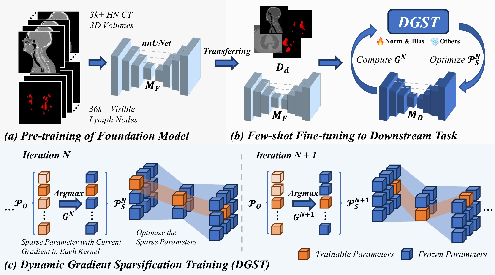

# LN-Seg-FM

This repository contains the official PyTorch implementation of the paper [Dynamic Gradient Sparsification Training for Few-Shot Fine-tuning of CT Lymph Node Segmentation Foundation Model
](https://arxiv.org/abs/2503.00748) for few-shot fine-tuning of a lymph node (LN) segmentation foundation model (LN-Seg-FM) using nnUNetv2. The approach introduces a novel method that balances model stability and flexibility for LN segmentation tasks, which is critical for clinical applications with limited annotated data.

@article{luo2025dynamic,
  title={Dynamic Gradient Sparsification Training for Few-Shot Fine-tuning of CT Lymph Node Segmentation Foundation Model},
  author={Luo, Zihao and Gao, Zijun and Liao, Wenjun and Zhang, Shichuan and Wang, Guotai and Luo, Xiangde},
  journal={arXiv preprint arXiv:2503.00748},
  year={2025}
}
 
## Overview

We utilize nnUNetv2, a popular framework for medical image segmentation, to implement a series of `nnUNetTrainer` scripts. The specific trainer used in this implementation is **nnUNetTrainer_DGST.py**. Also includes several comparison methods that do not require additional implementation, such as Bias, Affine-IN, LoRA(Implemented via the PEFT library. For installation and usage, refer to the [peft](https://github.com/huggingface/peft) repository), etc. 

## Requirements
CUDA 12.4<br />
Python 3.11<br /> 
Pytorch 2.4.1<br />
CuDNN 9.1.0.70<br />
monai 1.3.0<br />
peft 0.14.0<br />
nnunetv2 2.5.1<br />
## Usage

### Installation

Please make sure that you have nnUNetv2 installed. Follow the installation instructions in the [nnUNetv2](https://github.com/MIC-DKFZ/nnUNet) repository.
* Clone this repo.
```
git clone https://github.com/Zihaoluoh/LN-Seg-FM.git
cd LN-Seg-FM
```
Transfer the custom trainer files into your nnUNetv2/training/nnUNetTrainer directory:
```
bash
mv nnUNetTrainer_DGST.py /path/to/nnUNetv2/training/nnUNetTrainer/
```
Train the model using the nnUNetv2_train -tr command, specifying the trainer:
```
nnUNetv2_train -tr nnUNetTrainer_DGST ...
```

## Dataset

The dataset used for training and evaluation consists of 36,106 annotated visible lymph nodes (LNs) across 3,346 publicly available head-and-neck CT scans [RADCURE](https://www.cancerimagingarchive.net/collection/radcure). The annotated visible lymph nodes mask will be publicly available upon acceptance.

## Pre-trained models
We provide pre-trained weights for multiple models with different structures, including the original nnUNet, ResEncM nnUNet, ResEncL nnUNet, SwinUNETR and SwinUNETRv2(both implemented with MONAI; see [`nnUNetTrainer_SwinUNETR`](nnUNetTrainer/nnUNetTrainer_SwinUNETR.py). Our internal validation of the original data is as follows. You can choose the model to use according to your needs([Google Drive](https://drive.google.com/drive/folders/1ydvmX6tneDdvVUqWF7o8d_C0HJMf9v3c?usp=sharing)|[Baidu Drive](https://pan.baidu.com/s/1mmooYfYawXexUlU87bfZ1A?pwd=LNFM)), our experiments were conducted on a cluster with 8 NVIDIA Tesla V100S 32GB GPUs.
| Model Name        | Dice Score          | Approximate Training Time (per 250 iterations) | VRAM Use(GB) |
|-------------------|---------------------|------------------------------------|--------------|
| nnUNet          | 81.72%                | ~53.8 seconds                      | ~7.9 GBs  |
| ResEncM           | 81.44%                | ~74.5 seconds                         | ~8.6 GBs|
| ResEncL           | 83.55%                | ~203.2 seconds                         | ~22.6 GBs |
| SwinUNETR           | 80.52%                | ~126.9 seconds                         | ~15.9 GBs|
| SwinUNETRv2           | 80.97%                | ~131.4 seconds                         | ~14.5 GBs |

When you use our pre-trained weights, please modify the `architecture` in `nnUNetPlans.json` of the corresponding dataset under your nnUNet_preprocess path to be consistent with our model. Usually we recommend the following steps:
```
"your_new_configuration": {
            "inherits_from": "3d_fullres",
            "patch_size": [
                80,
                112, #adjust with your dataset#
                214
            ],
            "architecture": {
            #Copy here#
            }
        },
```
Then, you can train with our nnUNet pre-trained weights:

```
nnUNetv2_train DATASETID your_new_configuration -pretrained_weights
```

If you used ResEnc, use `nnUNetv2_plan_experiment` and follow the above steps. For SwinUNETR and SwinUNETRv2, we define the model under `build_network_architecture`.

## Acknowledgements
We would like to express our gratitude to the following libraries:
- **[nnUNet](https://github.com/MIC-DKFZ/nnUNet)**
- **[MONAI](https://github.com/Project-MONAI/MONAI)**
- **[MShub](https://github.com/Luoxd1996/MSHub)**
